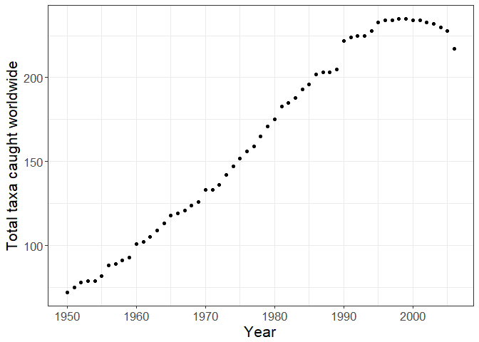
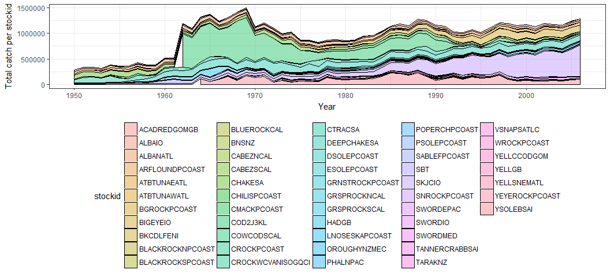

Overfishing Exercise
================
Chelsea Andreozzi and Dana Miller

Unit 3: Fisheries Collapse Module
=================================

This module will focus on understanding and replicating fisheries stock assessment data and fisheries collapse.

The Database
------------

We will use data from the [RAM Legacy Stock Assessment Database](http://ramlegacy.marinebiodiversity.ca/ram-legacy-stock-assessment-database)

First, load in the necessary libraries. Note that this time we need a package we haven't used before `readxl`. This package is useful for reading in .xls or .xlsx files. As always if you want more info on a package run `?readxl` after loading it.

``` r
library("tidyverse")
library("readxl")
library("scales") # For y-axis labels not in scientific notation - is there a better way to do this since 2012?
```

Reading in the tables
---------------------

``` r
download.file("https://depts.washington.edu/ramlegac/wordpress/databaseVersions/RLSADB_v3.0_(assessment_data_only)_excel.zip", 
              "ramlegacy.zip")
path <- unzip("ramlegacy.zip")  # unzip the .xls files 
sheets <- readxl::excel_sheets(path) # use the readxl package to identify sheet names 

# purrr:map is the tidyverse version of lapply
ram <- lapply(sheets, readxl::read_excel, path = path)  # read the data from all 3 sheets into a list
names(ram) <- sheets # give the list of datatables their assigned sheet names

## check the names
names(ram)
```

    ##  [1] "area"                    "assessment"             
    ##  [3] "assessmethod"            "assessor"               
    ##  [5] "biometrics"              "bioparams"              
    ##  [7] "bioparams_ids_views"     "bioparams_units_views"  
    ##  [9] "bioparams_values_views"  "management"             
    ## [11] "stock"                   "taxonomy"               
    ## [13] "timeseries"              "timeseries_ids_views"   
    ## [15] "timeseries_units_views"  "timeseries_values_views"
    ## [17] "tsmetrics"

``` r
## check our data
head(ram$area)
```

    ## # A tibble: 6 x 6
    ##     country areatype areacode                            areaname
    ##       <chr>    <chr>    <chr>                               <chr>
    ## 1 Argentina      CFP    ARG-N                  Northern Argentina
    ## 2 Argentina      CFP    ARG-S                  Southern Argentina
    ## 3 Australia     AFMA  CASCADE                     Cascade Plateau
    ## 4 Australia     AFMA      ESE Eastern half of Southeast Australia
    ## 5 Australia     AFMA      GAB              Great Australian Bight
    ## 6 Australia     AFMA       MI                    Macquarie Island
    ## # ... with 2 more variables: alternateareaname <chr>, areaid <chr>

Exercise 1: Investigating the North-Atlantic Cod
================================================

First, we seek to replicate the following figure from the Millenium Ecosystem Assessment Project using the RAM data.


Task 1: Joining the necessary data
----------------------------------

To replicate this plot, we need a table with the following columns: `"country"`, `"ssb_unit"`, `"catch_landings_unit"`, `"scientificname"`, `"commonname"`, `"year"`, `"ssb"`, and `"TC"`.

Using the `select()` and `join()` functions you were introduced to in in Module 1, build a tidy table with the desired columns.

``` r
# Suggestion: separate blocks within each category added first, e.g. timeseriesunits <- select(data, TCunits=TC....)

# Code to look at categories of all the data tables
lapply(ram, names) # can use instead of viewer
```

    ## $area
    ## [1] "country"           "areatype"          "areacode"         
    ## [4] "areaname"          "alternateareaname" "areaid"           
    ## 
    ## $assessment
    ##  [1] "assessid"       "assessorid"     "stockid"        "stocklong"     
    ##  [5] "recorder"       "daterecorded"   "dateloaded"     "assessyear"    
    ##  [9] "assesssource"   "contacts"       "notes"          "pdffile"       
    ## [13] "assess"         "refpoints"      "assessmethod"   "assesscomments"
    ## [17] "xlsfilename"    "mostrecent"    
    ## 
    ## $assessmethod
    ## [1] "category"    "methodshort" "methodlong" 
    ## 
    ## $assessor
    ## [1] "assessorid"   "mgmt"         "country"      "assessorfull"
    ## 
    ## $biometrics
    ## [1] "category"      "subcategory"   "bioshort"      "biolong"      
    ## [5] "biounitsshort" "biounitslong"  "biounique"    
    ## 
    ## $bioparams
    ## [1] "assessid"  "stockid"   "stocklong" "bioid"     "biovalue"  "bioyear"  
    ## [7] "bionotes" 
    ## 
    ## $bioparams_ids_views
    ##  [1] "assessid"  "stockid"   "stocklong" "Bmsy"      "SSBmsy"   
    ##  [6] "Nmsy"      "MSY"       "Fmsy"      "Umsy"      "B0"       
    ## [11] "SSB0"      "M"         "Bmsytouse" "Umsytouse" "Bmgt"     
    ## [16] "SSBmgt"    "Fmgt"      "Umgt"      "Bmgttouse" "Umgttouse"
    ## 
    ## $bioparams_units_views
    ##  [1] "assessid"  "stockid"   "stocklong" "Bmsy"      "SSBmsy"   
    ##  [6] "Nmsy"      "MSY"       "Fmsy"      "Umsy"      "B0"       
    ## [11] "SSB0"      "M"         "Bmgt"      "SSBmgt"    "Fmgt"     
    ## [16] "Umgt"     
    ## 
    ## $bioparams_values_views
    ##  [1] "assessid"  "stockid"   "stocklong" "Bmsy"      "SSBmsy"   
    ##  [6] "Nmsy"      "MSY"       "Fmsy"      "Umsy"      "B0"       
    ## [11] "SSB0"      "M"         "Bmsytouse" "Umsytouse" "Bmgt"     
    ## [16] "SSBmgt"    "Fmgt"      "Umgt"      "Bmgttouse" "Umgttouse"
    ## 
    ## $management
    ## [1] "mgmt"                "country"             "managementauthority"
    ## 
    ## $stock
    ## [1] "stockid"        "tsn"            "scientificname" "commonname"    
    ## [5] "areaid"         "stocklong"      "region"         "inmyersdb"     
    ## [9] "myersstockid"  
    ## 
    ## $taxonomy
    ##  [1] "tsn"                 "scientificname"      "kingdom"            
    ##  [4] "phylum"              "classname"           "ordername"          
    ##  [7] "family"              "genus"               "species"            
    ## [10] "myersname"           "commonname1"         "commonname2"        
    ## [13] "myersscientificname" "myersfamily"         "FisheryType"        
    ## 
    ## $timeseries
    ## [1] "assessid"  "stockid"   "stocklong" "tsid"      "tsyear"    "tsvalue"  
    ## 
    ## $timeseries_ids_views
    ##  [1] "assessid"      "stockid"       "stocklong"     "TB"           
    ##  [5] "SSB"           "TN"            "R"             "TC"           
    ##  [9] "TL"            "F"             "ER"            "BdivBmsy"     
    ## [13] "SSBdivSSBmsy"  "FdivFmsy"      "UdivUmsy"      "Btouse"       
    ## [17] "Ctouse"        "Utouse"        "BdivBmsytouse" "UdivUmsytouse"
    ## [21] "BdivBmgt"      "SSBdivSSBmgt"  "FdivFmgt"      "UdivUmgt"     
    ## [25] "BdivBmgttouse" "UdivUmgttouse"
    ## 
    ## $timeseries_units_views
    ##  [1] "assessid"  "stockid"   "stocklong" "TB"        "SSB"      
    ##  [6] "TN"        "R"         "TC"        "TL"        "F"        
    ## [11] "ER"       
    ## 
    ## $timeseries_values_views
    ##  [1] "assessid"    "stockid"     "stocklong"   "year"        "TB"         
    ##  [6] "SSB"         "TN"          "R"           "TC"          "TL"         
    ## [11] "F"           "ER"          "B/Bmsy"      "SSB/SSBmsy"  "F/Fmsy"     
    ## [16] "U/Umsy"      "Btouse"      "Ctouse"      "Utouse"      "B/Bmsytouse"
    ## [21] "U/Umsytouse" "B/Bmgt"      "SSB/SSBmgt"  "F/Fmgt"      "U/Umgt"     
    ## [26] "B/Bmgttouse" "U/Umgttouse"
    ## 
    ## $tsmetrics
    ## [1] "tscategory"   "tsshort"      "tslong"       "tsunitsshort"
    ## [5] "tsunitslong"  "tsunique"

``` r
Code to look at head() of all the data tables
lapply(ram, head)
```

``` r
# Join our variables of interest
ourdata <- left_join(ram$timeseries_values_views, ram$timeseries_units_views, 
  by = c("assessid", "stockid")) %>%
  rename(SSB = SSB.x, SSBunits = SSB.y, Total_Catch = TC.x, Total_Catch_units = TC.y) %>%
  left_join(ram$stock, by = "stockid") %>%
  left_join(ram$area, by = "areaid") %>%
  select("year", "country", "scientificname", "commonname", "SSB", "SSBunits", "Total_Catch", "Total_Catch_units")

head(ourdata)
```

    ## # A tibble: 6 x 8
    ##    year country     scientificname      commonname    SSB SSBunits
    ##   <dbl>   <chr>              <chr>           <chr>  <dbl>    <chr>
    ## 1  1913     USA Sebastes fasciatus Acadian redfish 642256       MT
    ## 2  1914     USA Sebastes fasciatus Acadian redfish 642246       MT
    ## 3  1915     USA Sebastes fasciatus Acadian redfish 642221       MT
    ## 4  1916     USA Sebastes fasciatus Acadian redfish 642194       MT
    ## 5  1917     USA Sebastes fasciatus Acadian redfish 642167       MT
    ## 6  1918     USA Sebastes fasciatus Acadian redfish 642156       MT
    ## # ... with 2 more variables: Total_Catch <dbl>, Total_Catch_units <chr>

Task 2: Mapping the Area table to marine regions
------------------------------------------------

In order to replicate the collapse of Atlantic Cod, we need to be able to map area table from the Ram database to the marine regions.

*As an aside, this database is unclear what kind of areas the `area` table is using, they do not appear to be LMEs, EEZs, or other obvious marine region classification. Regardless, we will use them to extract the North America cod stocks.*

Write code to pull all marine areas (listed in `ram$area`) that contain a certain substring in their name -- ex. "Georges Bank". Hint: you want want to consider functions `filter()` or `grep()`

``` r
GeorgesBank <- ram$area %>%
  filter(areaname == "Georges Bank")
GeorgesBank
```

    ## # A tibble: 5 x 6
    ##         country areatype areacode     areaname alternateareaname
    ##           <chr>    <chr>    <chr>        <chr>             <chr>
    ## 1        Canada      DFO       5Z Georges Bank                NA
    ## 2        Canada      DFO    5Zejm Georges Bank                NA
    ## 3        Canada      DFO     5Zjm Georges Bank                NA
    ## 4 multinational     TRAC       5Z Georges Bank                NA
    ## 5           USA     NMFS       5Z Georges Bank                NA
    ## # ... with 1 more variables: areaid <chr>

We are interested in mapping the data from just the areas where Atlantic Cod are found. Using the table you built above, pull out distinct areas that contain Atlantic Cod populations into a new tidytable. Hint: you may want to use functions like `filter()` or `distinct()`

``` r
# We don't have areaid because we took that out of our data table above. 
# We're building another table to include it!

ourdata_withareaid <- left_join(ram$timeseries_values_views, ram$timeseries_units_views, 
  by = c("assessid", "stockid")) %>%
  rename(SSB = SSB.x, SSBunits = SSB.y, Total_Catch = TC.x, Total_Catch_units = TC.y) %>%
  left_join(ram$stock, by = "stockid") %>%
  left_join(ram$area, by = "areaid") %>%
  select("year", "country", "areaid", "scientificname", "commonname", "SSB", "SSBunits", "Total_Catch", "Total_Catch_units")

cod_only <- ourdata_withareaid %>%
  filter(commonname == "Atlantic cod")
cod_only
```

    ## # A tibble: 1,069 x 9
    ##     year country           areaid scientificname   commonname   SSB
    ##    <dbl>   <chr>            <chr>          <chr>        <chr> <dbl>
    ##  1  1850  Canada Canada-DFO-2J3KL   Gadus morhua Atlantic cod    NA
    ##  2  1851  Canada Canada-DFO-2J3KL   Gadus morhua Atlantic cod    NA
    ##  3  1852  Canada Canada-DFO-2J3KL   Gadus morhua Atlantic cod    NA
    ##  4  1853  Canada Canada-DFO-2J3KL   Gadus morhua Atlantic cod    NA
    ##  5  1854  Canada Canada-DFO-2J3KL   Gadus morhua Atlantic cod    NA
    ##  6  1855  Canada Canada-DFO-2J3KL   Gadus morhua Atlantic cod    NA
    ##  7  1856  Canada Canada-DFO-2J3KL   Gadus morhua Atlantic cod    NA
    ##  8  1857  Canada Canada-DFO-2J3KL   Gadus morhua Atlantic cod    NA
    ##  9  1858  Canada Canada-DFO-2J3KL   Gadus morhua Atlantic cod    NA
    ## 10  1859  Canada Canada-DFO-2J3KL   Gadus morhua Atlantic cod    NA
    ## # ... with 1,059 more rows, and 3 more variables: SSBunits <chr>,
    ## #   Total_Catch <dbl>, Total_Catch_units <chr>

Task 3: Subsetting our data by regional id
------------------------------------------

Using bracket notation and or the `filter()` and `pull()` functions, try pulling certain subsets of ids from your table of cod areas. ex. the first 8 ids, or the ids of areas just within a certain country.

Create a vector of ids of areas with Atlantic Cod and in Canada.

``` r
#First experiment
cod_only %>%
  select(country, areaid) %>%
  distinct() %>%
  left_join(ram$area, by = "areaid")
```

    ## # A tibble: 19 x 7
    ##        country.x                   areaid     country.y areatype areacode
    ##            <chr>                    <chr>         <chr>    <chr>    <chr>
    ##  1        Canada         Canada-DFO-2J3KL        Canada      DFO    2J3KL
    ##  2 multinational    multinational-NAFO-3M multinational     NAFO       3M
    ##  3 multinational   multinational-NAFO-3NO multinational     NAFO      3NO
    ##  4        Canada        Canada-DFO-3Pn4RS        Canada      DFO   3Pn4RS
    ##  5        Canada           Canada-DFO-3Ps        Canada      DFO      3Ps
    ##  6        Canada            Canada-DFO-4T        Canada      DFO       4T
    ##  7        Canada          Canada-DFO-4VsW        Canada      DFO     4VsW
    ##  8        Canada            Canada-DFO-4X        Canada      DFO       4X
    ##  9 multinational multinational-ICES-22-24 multinational     ICES    22-24
    ## 10 multinational multinational-ICES-25-32 multinational     ICES    25-32
    ## 11 multinational   multinational-ICES-Vb1 multinational     ICES      Vb1
    ## 12           USA              USA-NMFS-5Z           USA     NMFS       5Z
    ## 13           USA              USA-NMFS-5Y           USA     NMFS       5Y
    ## 14 multinational    multinational-ICES-Va multinational     ICES       Va
    ## 15 multinational  multinational-ICES-VIIa multinational     ICES     VIIa
    ## 16 multinational  multinational-ICES-IIIa multinational     ICES     IIIa
    ## 17 multinational  multinational-ICES-I-II multinational     ICES     I-II
    ## 18 multinational    multinational-ICES-IV multinational     ICES       IV
    ## 19 multinational   multinational-ICES-VIa multinational     ICES      VIa
    ## # ... with 2 more variables: areaname <chr>, alternateareaname <chr>

``` r
# The output above showed us that first 8 ids referred to DFO which is Canada, and NAFO
# which is multinational but next to Canadian waters, so we'll include both of these

CanadianCodareas <- cod_only %>%
   select(country, areaid) %>%
  distinct() %>%
  left_join(ram$area, by = "areaid") %>%
  filter(areatype == "DFO" | areatype == "NAFO") %>%
  pull(areaid)

#Vector of ids with Atlantic cod and in or adjacent to Canadian waters
CanadianCodareas
```

    ## [1] "Canada-DFO-2J3KL"       "multinational-NAFO-3M" 
    ## [3] "multinational-NAFO-3NO" "Canada-DFO-3Pn4RS"     
    ## [5] "Canada-DFO-3Ps"         "Canada-DFO-4T"         
    ## [7] "Canada-DFO-4VsW"        "Canada-DFO-4X"

Task 4: Plotting Total Catch in Canada
--------------------------------------

Calculate and plot the catch in million tons (MT) of Atlantic Cod from Canada using the data table and vector of ids you created above. Hint: you may want to use functions like `group_by()`, `filter()`, and/or `summarise()`

``` r
CanadianCodCatch <- cod_only %>%
  left_join(ram$area, by = "areaid") %>%
  filter(areatype == "DFO" | areatype == "NAFO") %>%
  group_by(year) %>%
  summarize(CN_catch=sum(Total_Catch, na.rm = TRUE))

# note: below is an alternative way that we could have written this 
# and it gives same result so we are including it for reference

# CanadianCodCatch <- cod_only %>%
  # filter(areaid %in% CanadianCodareas) %>%
  # group_by(year) %>%
  # summarize(CN_catch=sum(Total_Catch, na.rm = TRUE))  


plot1 <- ggplot(CanadianCodCatch, aes(y = CN_catch, x = year)) +
      geom_line() +
      ylab("Cod catch in CA and adjacent waters (tons)")+
      xlab("Year")+
      scale_y_continuous(breaks = c( 0, 100000, 200000, 300000, 400000, 500000, 600000, 700000, 800000, 900000, 1000000, 1100000), labels = comma) +
      theme_bw() +
      theme(text=element_text(size=16))
plot1  
```


**Question:** How does this graph compare to the one presented above?

It shows a very similar trend of peak and collapse as the original plot, with slightly higher overall number of fish, probably because we also included the multinational fisheries bordering Canadian waters.

------------------------------------------------------------------------

Exercise 2: Group Assignment
============================

Stock Collapses
---------------

We seek to replicate the temporal trend in stock declines shown in [Worm et al 2006](http://doi.org/10.1126/science.1132294):


**Question 1:** What years does this plot include? What is it plotting?

-   Plot includes the years 1950 - 2003
-   It shows the percent of taxa classified as collapsed with diamonds representing collapses by year, triangles representing cumulative collapse, blue representing species poor large marine ecosystem areas (LMEs), red representing species rich areas, and black represnting the combined total (of poor and rich areas).

Task 1: Plotting total taxa caught worldwide 1950-2006
------------------------------------------------------

Adapting the table you created in the first exercise, select and manipulate the necessary columns to plot the number of total taxa caught each year from 1950 til 2006 using `geom_point()`.

Hint: you may want to use functions like `group_by()`, `tally()` and be sure to carefully consider how to handle or omit missing values.

``` r
# we need rows by year and a tally of each species caught for each year
tallied_species <- ourdata %>%
  filter(year >= 1950 & year <= 2006) %>%
  group_by(year) %>%
  summarise(count = n_distinct(scientificname))
head(tallied_species) # head data looks correct
```

    ## # A tibble: 6 x 2
    ##    year count
    ##   <dbl> <int>
    ## 1  1950    72
    ## 2  1951    75
    ## 3  1952    78
    ## 4  1953    79
    ## 5  1954    79
    ## 6  1955    82

``` r
tail(tallied_species) # tail data looks correct
```

    ## # A tibble: 6 x 2
    ##    year count
    ##   <dbl> <int>
    ## 1  2001   234
    ## 2  2002   233
    ## 3  2003   232
    ## 4  2004   230
    ## 5  2005   228
    ## 6  2006   217

``` r
## Now we can plot total taxa caught worldwide 1950-2006

total_taxa_plot <- ggplot(tallied_species, aes(x = year, y = count)) +
  geom_point() +
  ylab("Total taxa caught worldwide")+
      xlab("Year")+
      theme_bw() +
      theme(text=element_text(size=16))
total_taxa_plot
```



Task 2: Removing incomplete datasets
------------------------------------

Species can either have missing data (within a series) or a time range that just doesn't span the full interval. Grouping by stockid instead of year, build a character vector containing only those stockids that have data for the full range (1950-2006).

``` r
# we need to get stockid back into our dataset
# we could probably just fix this in an earlier step but we're going to build a new table with it here

ourdata_withstockid <- left_join(ram$timeseries_values_views, ram$timeseries_units_views, 
  by = c("assessid", "stockid")) %>%
  rename(SSB = SSB.x, SSBunits = SSB.y, Total_Catch = TC.x, Total_Catch_units = TC.y) %>%
  left_join(ram$stock, by = "stockid") %>%
  left_join(ram$area, by = "areaid") %>%
  select("year", "country", "areaid", "stockid", "scientificname", "commonname", "SSB", "SSBunits", "Total_Catch", "Total_Catch_units")

stockid_fullyearrange <- ourdata_withstockid %>% 
  filter(year >= 1950 & year <= 2006) %>% # directed year range
  group_by(stockid) %>% 
  summarise(count = n()) %>%  # gives count of number of years each stock id is recorded 
  filter(count == 57) %>% # 57 is our full range of years 1950-2006
  select("stockid") # built character vector

head(stockid_fullyearrange) # character vector looks plausible
```

    ## # A tibble: 6 x 1
    ##          stockid
    ##            <chr>
    ## 1   ACADREDGOMGB
    ## 2         ALBAIO
    ## 3       ALBANATL
    ## 4 ARFLOUNDPCOAST
    ## 5    ATBTUNAEATL
    ## 6    ATBTUNAWATL

**Question 2:** How many taxa have data for the full range?

63 taxa! See code below.

``` r
# There are 90 stock ids with data for the full range.
count(stockid_fullyearrange)
```

    ## # A tibble: 1 x 1
    ##       n
    ##   <int>
    ## 1    90

``` r
# But now we need to match this with species name for taxa count.

## Below code gives us full catch data again but filtered for our 90 stock ids
complete_catch_data <- semi_join(ourdata_withstockid, stockid_fullyearrange) %>%
  filter(year >= 1950 & year <= 2006)  # directed year range
```

``` r
## This gives us a count of taxa from the new table we just created
complete_catch_data %>% 
  group_by(scientificname) %>%
  distinct(scientificname) %>%
  nrow()
```

    ## [1] 63

``` r
# Note: could have used filter with %in% vector version of ==
```

Task 3: Which fisheries have collapsed?
---------------------------------------

A fishery may be considered *collapsed* when total catch (TC) falls below 10% of its peak. For those stocks with complete data sets, create a new tidy table including columns: `stockid`, `TC`, `year`, `collapsed`, and `cumulative`, where `collapsed` is a logical (True or False) for whether or not that fishery could be considered collapsed in that year, and `cumulative` is the count of total years the fishery has been collapsed at that point in time.

``` r
#First attempt to find peak TC between 1950 and 2006
 test_0 <- complete_catch_data %>%
          group_by(stockid) %>%
          mutate(PeakTC = max(Total_Catch)) %>% # do more mutate for % and if collapsed
          mutate(PercentOfPeak = (Total_Catch/PeakTC)) %>%
          mutate(Collapsed = (PercentOfPeak < 0.1)) %>% 
  #added logical operator TRUE = 1 means collapsed
  #this should allow us to do a sum of column for cumulative collapsed years
          mutate(Cumulative = cumsum(Collapsed)) %>%
          select(stockid, year, Total_Catch, PeakTC, PercentOfPeak, Collapsed, Cumulative)
  
head(test_0)
```

    ## # A tibble: 6 x 7
    ## # Groups:   stockid [1]
    ##        stockid  year Total_Catch PeakTC PercentOfPeak Collapsed Cumulative
    ##          <chr> <dbl>       <dbl>  <dbl>         <dbl>     <lgl>      <int>
    ## 1 ACADREDGOMGB  1950       34307  34307     1.0000000     FALSE          0
    ## 2 ACADREDGOMGB  1951       30077  34307     0.8767015     FALSE          0
    ## 3 ACADREDGOMGB  1952       21377  34307     0.6231090     FALSE          0
    ## 4 ACADREDGOMGB  1953       16791  34307     0.4894336     FALSE          0
    ## 5 ACADREDGOMGB  1954       12988  34307     0.3785816     FALSE          0
    ## 6 ACADREDGOMGB  1955       13914  34307     0.4055732     FALSE          0

``` r
tail(test_0)
```

    ## # A tibble: 6 x 7
    ## # Groups:   stockid [1]
    ##         stockid  year Total_Catch PeakTC PercentOfPeak Collapsed
    ##           <chr> <dbl>       <dbl>  <dbl>         <dbl>     <lgl>
    ## 1 YTSNAPSATLCGM  2001          NA     NA            NA        NA
    ## 2 YTSNAPSATLCGM  2002          NA     NA            NA        NA
    ## 3 YTSNAPSATLCGM  2003          NA     NA            NA        NA
    ## 4 YTSNAPSATLCGM  2004          NA     NA            NA        NA
    ## 5 YTSNAPSATLCGM  2005          NA     NA            NA        NA
    ## 6 YTSNAPSATLCGM  2006          NA     NA            NA        NA
    ## # ... with 1 more variables: Cumulative <int>

What the above table building revealed is that we haven't filtered all missing values out yet. Some of the taxa which we assumed had complete data based on having an entry for every year between 1950-2006 are actually missing stock or total catch data.

Another concern is that some fisheries are recorded as collapsed in earlier years because the total catch was initially less than 10% of the peak total catch. This doesn't really make sense because it is more of a statement of the fishing economy than the health of that fish stock at the time. This needs to be examined further and the count of cumulative collapsed years will not really be accurate until this has been resolved.

We looked into two ways to filter the missing data: <https://stackoverflow.com/questions/26665319/removing-na-in-dplyr-pipe?rq=1>

-   na.omit
-   complete.cases

``` r
#Experiment filtering complete_catch_data with complete.cases

test1 <- complete_catch_data %>%
          filter(complete.cases(.)) %>% # removes rows with NA values
          group_by(stockid) %>%
          mutate(PeakTC = max(Total_Catch)) %>% 
          mutate(PercentOfPeak = (Total_Catch/PeakTC)) %>%
          mutate(Collapsed = (PercentOfPeak < 0.1)) %>% 
          mutate(Cumulative = cumsum(Collapsed)) %>%
          select(stockid, year, Total_Catch, PeakTC, PercentOfPeak, Collapsed, Cumulative)
summary(test1)  
```

    ##    stockid               year       Total_Catch           PeakTC      
    ##  Length:2616        Min.   :1950   Min.   :     0.0   Min.   :   135  
    ##  Class :character   1st Qu.:1966   1st Qu.:   302.9   1st Qu.:  1768  
    ##  Mode  :character   Median :1980   Median :  2046.9   Median :  7802  
    ##                     Mean   :1980   Mean   : 20947.4   Mean   : 60568  
    ##                     3rd Qu.:1994   3rd Qu.: 15529.0   3rd Qu.: 43855  
    ##                     Max.   :2006   Max.   :811698.0   Max.   :811698  
    ##  PercentOfPeak    Collapsed         Cumulative    
    ##  Min.   :0.0000   Mode :logical   Min.   : 0.000  
    ##  1st Qu.:0.1191   FALSE:2019      1st Qu.: 0.000  
    ##  Median :0.3228   TRUE :597       Median : 4.000  
    ##  Mean   :0.3598                   Mean   : 7.201  
    ##  3rd Qu.:0.5375                   3rd Qu.:11.000  
    ##  Max.   :1.0000                   Max.   :41.000

``` r
head(test1)
```

    ## # A tibble: 6 x 7
    ## # Groups:   stockid [1]
    ##        stockid  year Total_Catch PeakTC PercentOfPeak Collapsed Cumulative
    ##          <chr> <dbl>       <dbl>  <dbl>         <dbl>     <lgl>      <int>
    ## 1 ACADREDGOMGB  1950       34307  34307     1.0000000     FALSE          0
    ## 2 ACADREDGOMGB  1951       30077  34307     0.8767015     FALSE          0
    ## 3 ACADREDGOMGB  1952       21377  34307     0.6231090     FALSE          0
    ## 4 ACADREDGOMGB  1953       16791  34307     0.4894336     FALSE          0
    ## 5 ACADREDGOMGB  1954       12988  34307     0.3785816     FALSE          0
    ## 6 ACADREDGOMGB  1955       13914  34307     0.4055732     FALSE          0

``` r
tail(test1)
```

    ## # A tibble: 6 x 7
    ## # Groups:   stockid [1]
    ##     stockid  year Total_Catch PeakTC PercentOfPeak Collapsed Cumulative
    ##       <chr> <dbl>       <dbl>  <dbl>         <dbl>     <lgl>      <int>
    ## 1 YSOLEBSAI  2001       63395 227107     0.2791416     FALSE          0
    ## 2 YSOLEBSAI  2002       73000 227107     0.3214344     FALSE          0
    ## 3 YSOLEBSAI  2003       74418 227107     0.3276781     FALSE          0
    ## 4 YSOLEBSAI  2004       69046 227107     0.3040241     FALSE          0
    ## 5 YSOLEBSAI  2005       94383 227107     0.4155882     FALSE          0
    ## 6 YSOLEBSAI  2006       99068 227107     0.4362173     FALSE          0

``` r
test1 %>% 
  group_by(stockid) %>%
  distinct(stockid)
```

    ## # A tibble: 51 x 1
    ## # Groups:   stockid [51]
    ##             stockid
    ##               <chr>
    ##  1     ACADREDGOMGB
    ##  2           ALBAIO
    ##  3         ALBANATL
    ##  4   ARFLOUNDPCOAST
    ##  5      ATBTUNAEATL
    ##  6      ATBTUNAWATL
    ##  7     BGROCKPCOAST
    ##  8         BIGEYEIO
    ##  9        BKCDLFENI
    ## 10 BLACKROCKNPCOAST
    ## # ... with 41 more rows

``` r
#Experiment filtering with na.omit


test2 <- complete_catch_data %>%
          na.omit() %>%     # removes rows with NA values
          group_by(stockid) %>%
          mutate(PeakTC = max(Total_Catch)) %>% 
          mutate(PercentOfPeak = (Total_Catch/PeakTC)) %>%
          mutate(Collapsed = (PercentOfPeak < 0.1)) %>% 
          mutate(Cumulative = cumsum(Collapsed)) %>%
          select(stockid, year, Total_Catch, PeakTC, PercentOfPeak, Collapsed, Cumulative)
  
summary(test2)
```

    ##    stockid               year       Total_Catch           PeakTC      
    ##  Length:2616        Min.   :1950   Min.   :     0.0   Min.   :   135  
    ##  Class :character   1st Qu.:1966   1st Qu.:   302.9   1st Qu.:  1768  
    ##  Mode  :character   Median :1980   Median :  2046.9   Median :  7802  
    ##                     Mean   :1980   Mean   : 20947.4   Mean   : 60568  
    ##                     3rd Qu.:1994   3rd Qu.: 15529.0   3rd Qu.: 43855  
    ##                     Max.   :2006   Max.   :811698.0   Max.   :811698  
    ##  PercentOfPeak    Collapsed         Cumulative    
    ##  Min.   :0.0000   Mode :logical   Min.   : 0.000  
    ##  1st Qu.:0.1191   FALSE:2019      1st Qu.: 0.000  
    ##  Median :0.3228   TRUE :597       Median : 4.000  
    ##  Mean   :0.3598                   Mean   : 7.201  
    ##  3rd Qu.:0.5375                   3rd Qu.:11.000  
    ##  Max.   :1.0000                   Max.   :41.000

``` r
head(test2)
```

    ## # A tibble: 6 x 7
    ## # Groups:   stockid [1]
    ##        stockid  year Total_Catch PeakTC PercentOfPeak Collapsed Cumulative
    ##          <chr> <dbl>       <dbl>  <dbl>         <dbl>     <lgl>      <int>
    ## 1 ACADREDGOMGB  1950       34307  34307     1.0000000     FALSE          0
    ## 2 ACADREDGOMGB  1951       30077  34307     0.8767015     FALSE          0
    ## 3 ACADREDGOMGB  1952       21377  34307     0.6231090     FALSE          0
    ## 4 ACADREDGOMGB  1953       16791  34307     0.4894336     FALSE          0
    ## 5 ACADREDGOMGB  1954       12988  34307     0.3785816     FALSE          0
    ## 6 ACADREDGOMGB  1955       13914  34307     0.4055732     FALSE          0

``` r
tail(test2)
```

    ## # A tibble: 6 x 7
    ## # Groups:   stockid [1]
    ##     stockid  year Total_Catch PeakTC PercentOfPeak Collapsed Cumulative
    ##       <chr> <dbl>       <dbl>  <dbl>         <dbl>     <lgl>      <int>
    ## 1 YSOLEBSAI  2001       63395 227107     0.2791416     FALSE          0
    ## 2 YSOLEBSAI  2002       73000 227107     0.3214344     FALSE          0
    ## 3 YSOLEBSAI  2003       74418 227107     0.3276781     FALSE          0
    ## 4 YSOLEBSAI  2004       69046 227107     0.3040241     FALSE          0
    ## 5 YSOLEBSAI  2005       94383 227107     0.4155882     FALSE          0
    ## 6 YSOLEBSAI  2006       99068 227107     0.4362173     FALSE          0

``` r
test2 %>% 
  group_by(stockid) %>%
  distinct(stockid)
```

    ## # A tibble: 51 x 1
    ## # Groups:   stockid [51]
    ##             stockid
    ##               <chr>
    ##  1     ACADREDGOMGB
    ##  2           ALBAIO
    ##  3         ALBANATL
    ##  4   ARFLOUNDPCOAST
    ##  5      ATBTUNAEATL
    ##  6      ATBTUNAWATL
    ##  7     BGROCKPCOAST
    ##  8         BIGEYEIO
    ##  9        BKCDLFENI
    ## 10 BLACKROCKNPCOAST
    ## # ... with 41 more rows

``` r
all.equal(test1,test2)
```

    ## [1] TRUE

Either option for omitting NA's appears to give identical results. We should go forward with one method but we'll keep all of the code above as a reminder for the future.

``` r
test_for_collapsed <- complete_catch_data %>%
          na.omit() %>%    
          group_by(stockid) %>%
          mutate(PeakTC = max(Total_Catch)) %>% 
          mutate(PercentOfPeak = (Total_Catch/PeakTC)) %>%
          mutate(Collapsed = (PercentOfPeak < 0.1)) %>% 
          mutate(Cumulative = cumsum(Collapsed)) %>%
          select(stockid, year, Total_Catch, PeakTC, PercentOfPeak, Collapsed, Cumulative)
```

Task 4: Plotting total catch
----------------------------

Using `geom_area()` plot the TC per stockid across all years.

``` r
TCplot <- ggplot(test_for_collapsed, aes(x=year, y=Total_Catch, fill=stockid)) + 
    geom_area(colour="black", size=.2, alpha=.4) + 
    ylab("Total catch per stockid")+
    xlab("Year")+
    theme_bw() +
    theme(legend.position="bottom")

TCplot
```



``` r
# Ideas for futher work
#There's probably a way we can set up the conditional so only the values of TotalCatc that are below 10% and come *after* the peak TC value (eg based on comparing the year of TC > peak of PeakTC) are counted as collapsed
```
