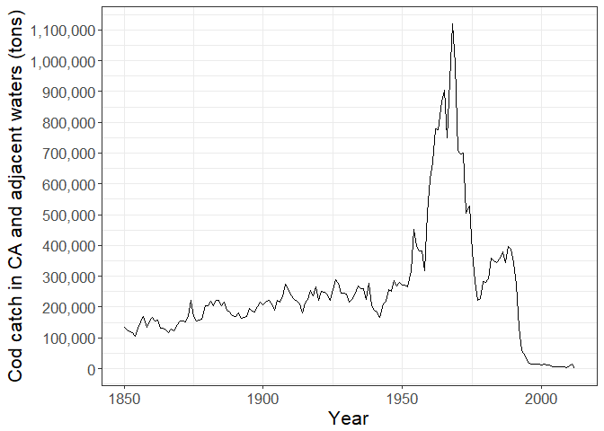

Overfishing Exercise
================
Chelsea Andreozzi and Dana Miller

Unit 3: Fisheries Collapse Module
=================================

This module will focus on understanding and replicating fisheries stock assessment data and fisheries collapse.

The Database
------------

We will use data from the [RAM Legacy Stock Assessment Database](http://ramlegacy.marinebiodiversity.ca/ram-legacy-stock-assessment-database)

First, load in the necessary libraries. Note that this time we need a package we haven't used before `readxl`. This package is useful for reading in .xls or .xlsx files. As always if you want more info on a package run `?readxl` after loading it.

``` r
library("tidyverse")
library("readxl")
library("scales") # For y-axis labels not in scientific notation - is there a better way to do this since 2012?
```

Reading in the tables
---------------------

``` r
download.file("https://depts.washington.edu/ramlegac/wordpress/databaseVersions/RLSADB_v3.0_(assessment_data_only)_excel.zip", 
              "ramlegacy.zip")
path <- unzip("ramlegacy.zip")  #unzip the .xls files 
sheets <- readxl::excel_sheets(path) #use the readxl package to identify sheet names 

#purrr:map is the tidyverse version of lapply
ram <- lapply(sheets, readxl::read_excel, path = path)  #read the data from all 3 sheets into a list
names(ram) <- sheets # give the list of datatables their assigned sheet names

## check your names
names(ram)
```

    ##  [1] "area"                    "assessment"             
    ##  [3] "assessmethod"            "assessor"               
    ##  [5] "biometrics"              "bioparams"              
    ##  [7] "bioparams_ids_views"     "bioparams_units_views"  
    ##  [9] "bioparams_values_views"  "management"             
    ## [11] "stock"                   "taxonomy"               
    ## [13] "timeseries"              "timeseries_ids_views"   
    ## [15] "timeseries_units_views"  "timeseries_values_views"
    ## [17] "tsmetrics"

``` r
## check your data
head(ram$area)
```

    ## # A tibble: 6 x 6
    ##   country   areatype areacode areaname         alternateareana~ areaid    
    ##   <chr>     <chr>    <chr>    <chr>            <chr>            <chr>     
    ## 1 Argentina CFP      ARG-N    Northern Argent~ NA               Argentina~
    ## 2 Argentina CFP      ARG-S    Southern Argent~ NA               Argentina~
    ## 3 Australia AFMA     CASCADE  Cascade Plateau  NA               Australia~
    ## 4 Australia AFMA     ESE      Eastern half of~ NA               Australia~
    ## 5 Australia AFMA     GAB      Great Australia~ NA               Australia~
    ## 6 Australia AFMA     MI       Macquarie Island <NA>             Australia~

Exercise 1: Investigating the North-Atlantic Cod
================================================

First, We seek to replicate the following figure from the Millenium Ecosystem Assessment Project using the RAM data.


Task 1: Joining the necessary data
----------------------------------

To replicate this plot, we need a table with the following columns: `"country"`, `"ssb_unit"`, `"catch_landings_unit"`, `"scientificname"`, `"commonname"`, `"year"`, `"ssb"`, and `"TC"`.

Using the `select()` and `join()` functions you were introduced to in in Module 1, build a tidy table with the desired columns.

``` r
# separate blocks within each category added first, e.g. timeseriesunits <- select(data, TCunits=TC....)

lapply(ram, names) # use instead of viewer
```

    ## $area
    ## [1] "country"           "areatype"          "areacode"         
    ## [4] "areaname"          "alternateareaname" "areaid"           
    ## 
    ## $assessment
    ##  [1] "assessid"       "assessorid"     "stockid"        "stocklong"     
    ##  [5] "recorder"       "daterecorded"   "dateloaded"     "assessyear"    
    ##  [9] "assesssource"   "contacts"       "notes"          "pdffile"       
    ## [13] "assess"         "refpoints"      "assessmethod"   "assesscomments"
    ## [17] "xlsfilename"    "mostrecent"    
    ## 
    ## $assessmethod
    ## [1] "category"    "methodshort" "methodlong" 
    ## 
    ## $assessor
    ## [1] "assessorid"   "mgmt"         "country"      "assessorfull"
    ## 
    ## $biometrics
    ## [1] "category"      "subcategory"   "bioshort"      "biolong"      
    ## [5] "biounitsshort" "biounitslong"  "biounique"    
    ## 
    ## $bioparams
    ## [1] "assessid"  "stockid"   "stocklong" "bioid"     "biovalue"  "bioyear"  
    ## [7] "bionotes" 
    ## 
    ## $bioparams_ids_views
    ##  [1] "assessid"  "stockid"   "stocklong" "Bmsy"      "SSBmsy"   
    ##  [6] "Nmsy"      "MSY"       "Fmsy"      "Umsy"      "B0"       
    ## [11] "SSB0"      "M"         "Bmsytouse" "Umsytouse" "Bmgt"     
    ## [16] "SSBmgt"    "Fmgt"      "Umgt"      "Bmgttouse" "Umgttouse"
    ## 
    ## $bioparams_units_views
    ##  [1] "assessid"  "stockid"   "stocklong" "Bmsy"      "SSBmsy"   
    ##  [6] "Nmsy"      "MSY"       "Fmsy"      "Umsy"      "B0"       
    ## [11] "SSB0"      "M"         "Bmgt"      "SSBmgt"    "Fmgt"     
    ## [16] "Umgt"     
    ## 
    ## $bioparams_values_views
    ##  [1] "assessid"  "stockid"   "stocklong" "Bmsy"      "SSBmsy"   
    ##  [6] "Nmsy"      "MSY"       "Fmsy"      "Umsy"      "B0"       
    ## [11] "SSB0"      "M"         "Bmsytouse" "Umsytouse" "Bmgt"     
    ## [16] "SSBmgt"    "Fmgt"      "Umgt"      "Bmgttouse" "Umgttouse"
    ## 
    ## $management
    ## [1] "mgmt"                "country"             "managementauthority"
    ## 
    ## $stock
    ## [1] "stockid"        "tsn"            "scientificname" "commonname"    
    ## [5] "areaid"         "stocklong"      "region"         "inmyersdb"     
    ## [9] "myersstockid"  
    ## 
    ## $taxonomy
    ##  [1] "tsn"                 "scientificname"      "kingdom"            
    ##  [4] "phylum"              "classname"           "ordername"          
    ##  [7] "family"              "genus"               "species"            
    ## [10] "myersname"           "commonname1"         "commonname2"        
    ## [13] "myersscientificname" "myersfamily"         "FisheryType"        
    ## 
    ## $timeseries
    ## [1] "assessid"  "stockid"   "stocklong" "tsid"      "tsyear"    "tsvalue"  
    ## 
    ## $timeseries_ids_views
    ##  [1] "assessid"      "stockid"       "stocklong"     "TB"           
    ##  [5] "SSB"           "TN"            "R"             "TC"           
    ##  [9] "TL"            "F"             "ER"            "BdivBmsy"     
    ## [13] "SSBdivSSBmsy"  "FdivFmsy"      "UdivUmsy"      "Btouse"       
    ## [17] "Ctouse"        "Utouse"        "BdivBmsytouse" "UdivUmsytouse"
    ## [21] "BdivBmgt"      "SSBdivSSBmgt"  "FdivFmgt"      "UdivUmgt"     
    ## [25] "BdivBmgttouse" "UdivUmgttouse"
    ## 
    ## $timeseries_units_views
    ##  [1] "assessid"  "stockid"   "stocklong" "TB"        "SSB"      
    ##  [6] "TN"        "R"         "TC"        "TL"        "F"        
    ## [11] "ER"       
    ## 
    ## $timeseries_values_views
    ##  [1] "assessid"    "stockid"     "stocklong"   "year"        "TB"         
    ##  [6] "SSB"         "TN"          "R"           "TC"          "TL"         
    ## [11] "F"           "ER"          "B/Bmsy"      "SSB/SSBmsy"  "F/Fmsy"     
    ## [16] "U/Umsy"      "Btouse"      "Ctouse"      "Utouse"      "B/Bmsytouse"
    ## [21] "U/Umsytouse" "B/Bmgt"      "SSB/SSBmgt"  "F/Fmgt"      "U/Umgt"     
    ## [26] "B/Bmgttouse" "U/Umgttouse"
    ## 
    ## $tsmetrics
    ## [1] "tscategory"   "tsshort"      "tslong"       "tsunitsshort"
    ## [5] "tsunitslong"  "tsunique"

``` r
lapply(ram, head)
```

    ## $area
    ## # A tibble: 6 x 6
    ##   country   areatype areacode areaname         alternateareana~ areaid    
    ##   <chr>     <chr>    <chr>    <chr>            <chr>            <chr>     
    ## 1 Argentina CFP      ARG-N    Northern Argent~ NA               Argentina~
    ## 2 Argentina CFP      ARG-S    Southern Argent~ NA               Argentina~
    ## 3 Australia AFMA     CASCADE  Cascade Plateau  NA               Australia~
    ## 4 Australia AFMA     ESE      Eastern half of~ NA               Australia~
    ## 5 Australia AFMA     GAB      Great Australia~ NA               Australia~
    ## 6 Australia AFMA     MI       Macquarie Island <NA>             Australia~
    ## 
    ## $assessment
    ## # A tibble: 6 x 18
    ##   assessid    assessorid stockid stocklong    recorder daterecorded       
    ##   <chr>       <chr>      <chr>   <chr>        <chr>    <dttm>             
    ## 1 NEFSC-ACAD~ NEFSC      ACADRE~ Acadian red~ MILLER   2009-04-16 00:00:00
    ## 2 IFOP-AFLON~ IFOP       AFLONCH Alfonsino C~ CHING    2013-03-18 00:00:00
    ## 3 IOTC-ALBAI~ IOTC       ALBAIO  Albacore tu~ CHING    2012-09-28 00:00:00
    ## 4 ICCAT-ALBA~ ICCAT      ALBAMED Albacore tu~ CHING    2012-09-28 00:00:00
    ## 5 ICCAT-ALBA~ ICCAT      ALBANA~ Albacore tu~ CHING    2012-09-25 00:00:00
    ## 6 ISC-ALBANP~ ISC        ALBANP~ Albacore tu~ CHING    2012-09-28 00:00:00
    ## # ... with 12 more variables: dateloaded <dttm>, assessyear <chr>,
    ## #   assesssource <chr>, contacts <chr>, notes <chr>, pdffile <chr>,
    ## #   assess <dbl>, refpoints <dbl>, assessmethod <chr>,
    ## #   assesscomments <chr>, xlsfilename <chr>, mostrecent <dbl>
    ## 
    ## $assessmethod
    ## # A tibble: 6 x 3
    ##   category               methodshort methodlong                           
    ##   <chr>                  <chr>       <chr>                                
    ## 1 Biomass dynamics model AAPM        Age-aggregated surplus production mo~
    ## 2 Biomass dynamics model ASPIC       Surplus production model             
    ## 3 Biomass dynamics model ASPM        Age-structured surplus production mo~
    ## 4 Biomass dynamics model BBM         Bayesian Biomass Model               
    ## 5 Biomass dynamics model BSPM        Bayesian Surplus Production Model    
    ## 6 Biomass dynamics model CSM         Collie-Sissenwine model              
    ## 
    ## $assessor
    ## # A tibble: 6 x 4
    ##   assessorid mgmt  country       assessorfull                             
    ##   <chr>      <chr> <chr>         <chr>                                    
    ## 1 ABARES     AFMA  Australia     "Australian Bureau of Agricultural and R~
    ## 2 ADFG       NMFS  USA           Alaska Department of Fish and Game       
    ## 3 ADRIAMED   GFCM  Multinational FAO Regional Project: Scientific Coopera~
    ## 4 AFSC       NMFS  USA           Alaska Fisheries Science Center          
    ## 5 AFWG       ICES  Multinational Arctic Fisheries Working Group           
    ## 6 ASMFC      NMFS  USA           Atlantic States Marine Fisheries Commiss~
    ## 
    ## $biometrics
    ## # A tibble: 6 x 7
    ##   category  subcategory bioshort biolong        biounitsshort biounitslong
    ##   <chr>     <chr>       <chr>    <chr>          <chr>         <chr>       
    ## 1 OTHER BI~ LIFE HISTO~ A50-1    Age at 50% ma~ yr            years       
    ## 2 OTHER BI~ LIFE HISTO~ A50-2    Age at 50% ma~ yr            years       
    ## 3 OTHER BI~ LIFE HISTO~ A50max   Maximum age a~ 0.5yr         half-year   
    ## 4 OTHER BI~ LIFE HISTO~ A50max   Maximum age a~ yr            years       
    ## 5 OTHER BI~ LIFE HISTO~ A50min   Minimum age a~ 0.5yr         half-year   
    ## 6 OTHER BI~ LIFE HISTO~ A50min   Minimum age a~ yr            years       
    ## # ... with 1 more variable: biounique <chr>
    ## 
    ## $bioparams
    ## # A tibble: 6 x 7
    ##   assessid    stockid  stocklong     bioid biovalue  bioyear bionotes     
    ##   <chr>       <chr>    <chr>         <chr> <chr>     <chr>   <chr>        
    ## 1 NEFSC-ACAD~ ACADRED~ Acadian redf~ A50-~ 5         2008    <NA>         
    ## 2 NEFSC-ACAD~ ACADRED~ Acadian redf~ Bmgt~ 883217.3~ NULL    SSBmsy-MT    
    ## 3 NEFSC-ACAD~ ACADRED~ Acadian redf~ Bmsy~ 883217.3~ NULL    SSBmsy-MT    
    ## 4 NEFSC-ACAD~ ACADRED~ Acadian redf~ F50%~ 3.769999~ 2008    F50% MSP-bas~
    ## 5 NEFSC-ACAD~ ACADRED~ Acadian redf~ F-AG~ 10+       2008    Fully-select~
    ## 6 NEFSC-ACAD~ ACADRED~ Acadian redf~ Fmsy~ 3.769999~ NULL    F50%-1/yr    
    ## 
    ## $bioparams_ids_views
    ## # A tibble: 6 x 20
    ##   assessid  stockid  stocklong  Bmsy  SSBmsy Nmsy  MSY   Fmsy  Umsy  B0   
    ##   <chr>     <chr>    <chr>      <chr> <chr>  <chr> <chr> <chr> <chr> <chr>
    ## 1 NEFSC-AC~ ACADRED~ Acadian r~ <NA>  SSBms~ <NA>  MSY-~ Fmsy~ Umsy~ <NA> 
    ## 2 IOTC-ALB~ ALBAIO   Albacore ~ Bmsy~ <NA>   <NA>  MSY-~ Fmsy~ <NA>  <NA> 
    ## 3 ICCAT-AL~ ALBAMED  Albacore ~ Bmsy~ <NA>   <NA>  MSY-~ <NA>  <NA>  B0-MT
    ## 4 ICCAT-AL~ ALBANATL Albacore ~ Bmsy~ SSBms~ <NA>  MSY-~ Fmsy~ Umsy~ B0-MT
    ## 5 ISC-ALBA~ ALBANPAC Albacore ~ Bmsy~ SSBms~ <NA>  MSY-~ Fmsy~ Umsy~ B0-MT
    ## 6 ICCAT-AL~ ALBASATL Albacore ~ Bmsy~ <NA>   <NA>  MSY-~ <NA>  <NA>  <NA> 
    ## # ... with 10 more variables: SSB0 <chr>, M <chr>, Bmsytouse <chr>,
    ## #   Umsytouse <chr>, Bmgt <lgl>, SSBmgt <chr>, Fmgt <chr>, Umgt <chr>,
    ## #   Bmgttouse <chr>, Umgttouse <chr>
    ## 
    ## $bioparams_units_views
    ## # A tibble: 6 x 16
    ##   assessid   stockid stocklong  Bmsy  SSBmsy Nmsy  MSY   Fmsy  Umsy  B0   
    ##   <chr>      <chr>   <chr>      <chr> <chr>  <chr> <chr> <chr> <chr> <chr>
    ## 1 NEFSC-ACA~ ACADRE~ Acadian r~ <NA>  MT     <NA>  MT    1/yr  ratio <NA> 
    ## 2 IOTC-ALBA~ ALBAIO  Albacore ~ MT    <NA>   <NA>  MT    1/yr  <NA>  <NA> 
    ## 3 ICCAT-ALB~ ALBAMED Albacore ~ MT    <NA>   <NA>  MT    <NA>  <NA>  MT   
    ## 4 ICCAT-ALB~ ALBANA~ Albacore ~ MT    MT     <NA>  MT    1/yr  ratio MT   
    ## 5 ISC-ALBAN~ ALBANP~ Albacore ~ MT    MT     <NA>  MT    1/yr  ratio MT   
    ## 6 ICCAT-ALB~ ALBASA~ Albacore ~ MT    <NA>   <NA>  MT    <NA>  <NA>  <NA> 
    ## # ... with 6 more variables: SSB0 <chr>, M <chr>, Bmgt <lgl>,
    ## #   SSBmgt <chr>, Fmgt <chr>, Umgt <chr>
    ## 
    ## $bioparams_values_views
    ## # A tibble: 6 x 20
    ##   assessid   stockid stocklong    Bmsy SSBmsy  Nmsy    MSY    Fmsy    Umsy
    ##   <chr>      <chr>   <chr>       <dbl>  <dbl> <dbl>  <dbl>   <dbl>   <dbl>
    ## 1 NEFSC-ACA~ ACADRE~ Acadian r~     NA 271000    NA  10139  0.0377  0.0163
    ## 2 IOTC-ALBA~ ALBAIO  Albacore ~ 346291     NA    NA  27022  0.180  NA     
    ## 3 ICCAT-ALB~ ALBAMED Albacore ~ 167213     NA    NA  28900 NA      NA     
    ## 4 ICCAT-ALB~ ALBANA~ Albacore ~  86556  53660    NA  29000  0.175   0.228 
    ## 5 ISC-ALBAN~ ALBANP~ Albacore ~ 806325 342854    NA 119094  0.122   0.147 
    ## 6 ICCAT-ALB~ ALBASA~ Albacore ~ 200546     NA    NA  27964 NA      NA     
    ## # ... with 11 more variables: B0 <dbl>, SSB0 <dbl>, M <dbl>,
    ## #   Bmsytouse <dbl>, Umsytouse <dbl>, Bmgt <lgl>, SSBmgt <dbl>,
    ## #   Fmgt <dbl>, Umgt <dbl>, Bmgttouse <dbl>, Umgttouse <dbl>
    ## 
    ## $management
    ## # A tibble: 6 x 3
    ##   mgmt   country       managementauthority                                
    ##   <chr>  <chr>         <chr>                                              
    ## 1 AFMA   Australia     Australian Fisheries Management Authority, Austral~
    ## 2 CCAMLR Multinational Commission for the Conservation of Antarctic Marin~
    ## 3 CCSBT  Multinational Commission for the Conservation of Southern Bluefi~
    ## 4 CFP    Argentina     Consejo Federal Pesquero, Argentina national manag~
    ## 5 DETMCM South Africa  South African national management, Fisheries Branc~
    ## 6 DFO    Canada        Department of Fisheries and Oceans, Canada nationa~
    ## 
    ## $stock
    ## # A tibble: 6 x 9
    ##   stockid     tsn scientificname  commonname  areaid  stocklong    region 
    ##   <chr>     <dbl> <chr>           <chr>       <chr>   <chr>        <chr>  
    ## 1 ACADRED~ 166774 Sebastes fasci~ Acadian re~ USA-NM~ Acadian red~ US Eas~
    ## 2 AFLONCH  166156 Beryx splendens Alfonsino   multin~ Alfonsino C~ South ~
    ## 3 ALBAIO   172419 Thunnus alalun~ albacore t~ multin~ Albacore tu~ Indian~
    ## 4 ALBAMED  172419 Thunnus alalun~ albacore t~ multin~ Albacore tu~ Medite~
    ## 5 ALBANATL 172419 Thunnus alalun~ Albacore t~ multin~ Albacore tu~ Atlant~
    ## 6 ALBANPAC 172419 Thunnus alalun~ Albacore t~ Multin~ Albacore tu~ US Wes~
    ## # ... with 2 more variables: inmyersdb <dbl>, myersstockid <chr>
    ## 
    ## $taxonomy
    ## # A tibble: 6 x 15
    ##     tsn scientificname  kingdom  phylum  classname  ordername family genus
    ##   <dbl> <chr>           <chr>    <chr>   <chr>      <chr>     <chr>  <chr>
    ## 1  -999 Pseudocarcinus~ Animalia Arthro~ Malacostr~ Decapoda  Menip~ Pseu~
    ## 2  -997 Haliotis iris   Animalia Mollus~ Gastropoda Archaeog~ Halio~ Hali~
    ## 3  -996 Haliotis spp    Animalia Mollus~ Gastropoda Archaeog~ Halio~ Hali~
    ## 4  -995 Haliotis midae  Animalia Mollus~ Gastropoda Archaeog~ Halio~ Hali~
    ## 5  -994 Sprattus fueng~ Animalia Chorda~ Actinopte~ Clupeifo~ Clupe~ Spra~
    ## 6  -993 Pleuroncodes m~ Animalia Arthro~ Malacostr~ Decapoda  Galat~ Pleu~
    ## # ... with 7 more variables: species <chr>, myersname <chr>,
    ## #   commonname1 <chr>, commonname2 <chr>, myersscientificname <chr>,
    ## #   myersfamily <chr>, FisheryType <chr>
    ## 
    ## $timeseries
    ## # A tibble: 6 x 6
    ##   assessid         stockid   stocklong          tsid        tsyear tsvalue
    ##   <chr>            <chr>     <chr>              <chr>        <dbl>   <dbl>
    ## 1 NEFSC-ACADREDGO~ ACADREDG~ Acadian redfish G~ BdivBmgtto~   1913    2.37
    ## 2 NEFSC-ACADREDGO~ ACADREDG~ Acadian redfish G~ BdivBmgtto~   1914    2.37
    ## 3 NEFSC-ACADREDGO~ ACADREDG~ Acadian redfish G~ BdivBmgtto~   1915    2.37
    ## 4 NEFSC-ACADREDGO~ ACADREDG~ Acadian redfish G~ BdivBmgtto~   1916    2.37
    ## 5 NEFSC-ACADREDGO~ ACADREDG~ Acadian redfish G~ BdivBmgtto~   1917    2.37
    ## 6 NEFSC-ACADREDGO~ ACADREDG~ Acadian redfish G~ BdivBmgtto~   1918    2.37
    ## 
    ## $timeseries_ids_views
    ## # A tibble: 6 x 26
    ##   assessid   stockid stocklong   TB    SSB   TN    R     TC    TL    F    
    ##   <chr>      <chr>   <chr>       <chr> <chr> <chr> <chr> <chr> <chr> <chr>
    ## 1 NEFSC-ACA~ ACADRE~ Acadian re~ <NA>  SSB-~ <NA>  R-E00 TC-MT TL-MT F-1/~
    ## 2 IFOP-AFLO~ AFLONCH Alfonsino ~ TB-MT SSB-~ <NA>  R-E00 <NA>  TL-MT <NA> 
    ## 3 IOTC-ALBA~ ALBAIO  Albacore t~ TB-MT SSB-~ <NA>  R-E00 TC-MT <NA>  <NA> 
    ## 4 ICCAT-ALB~ ALBAMED Albacore t~ TB-MT <NA>  <NA>  <NA>  TC-MT <NA>  <NA> 
    ## 5 ICCAT-ALB~ ALBANA~ Albacore t~ TB-MT SSB-~ <NA>  <NA>  TC-MT <NA>  F-1/~
    ## 6 ISC-ALBAN~ ALBANP~ Albacore t~ TB-MT SSB-~ <NA>  R-E00 TC-MT <NA>  <NA> 
    ## # ... with 16 more variables: ER <chr>, BdivBmsy <chr>,
    ## #   SSBdivSSBmsy <chr>, FdivFmsy <chr>, UdivUmsy <chr>, Btouse <chr>,
    ## #   Ctouse <chr>, Utouse <chr>, BdivBmsytouse <chr>, UdivUmsytouse <chr>,
    ## #   BdivBmgt <lgl>, SSBdivSSBmgt <chr>, FdivFmgt <chr>, UdivUmgt <chr>,
    ## #   BdivBmgttouse <chr>, UdivUmgttouse <chr>
    ## 
    ## $timeseries_units_views
    ## # A tibble: 6 x 11
    ##   assessid   stockid stocklong   TB    SSB   TN    R     TC    TL    F    
    ##   <chr>      <chr>   <chr>       <chr> <chr> <chr> <chr> <chr> <chr> <chr>
    ## 1 NEFSC-ACA~ ACADRE~ Acadian re~ <NA>  MT    <NA>  E00   MT    MT    1/yr 
    ## 2 IFOP-AFLO~ AFLONCH Alfonsino ~ MT    MT    <NA>  E00   <NA>  MT    <NA> 
    ## 3 IOTC-ALBA~ ALBAIO  Albacore t~ MT    MT    <NA>  E00   MT    <NA>  <NA> 
    ## 4 ICCAT-ALB~ ALBAMED Albacore t~ MT    <NA>  <NA>  <NA>  MT    <NA>  <NA> 
    ## 5 ICCAT-ALB~ ALBANA~ Albacore t~ MT    MT    <NA>  <NA>  MT    <NA>  1/yr 
    ## 6 ISC-ALBAN~ ALBANP~ Albacore t~ MT    MT    <NA>  E00   MT    <NA>  <NA> 
    ## # ... with 1 more variable: ER <chr>
    ## 
    ## $timeseries_values_views
    ## # A tibble: 6 x 27
    ##   assessid  stockid stocklong   year    TB    SSB TN         R    TC    TL
    ##   <chr>     <chr>   <chr>      <dbl> <dbl>  <dbl> <lgl>  <dbl> <dbl> <dbl>
    ## 1 NEFSC-AC~ ACADRE~ Acadian r~  1913    NA 642256 NA    5.13e7  7.00  7.00
    ## 2 NEFSC-AC~ ACADRE~ Acadian r~  1914    NA 642246 NA    5.21e7 30.0  30.0 
    ## 3 NEFSC-AC~ ACADRE~ Acadian r~  1915    NA 642221 NA    5.21e7 40.0  40.0 
    ## 4 NEFSC-AC~ ACADRE~ Acadian r~  1916    NA 642194 NA    5.21e7 53.0  53.0 
    ## 5 NEFSC-AC~ ACADRE~ Acadian r~  1917    NA 642167 NA    5.22e7 82.0  82.0 
    ## 6 NEFSC-AC~ ACADRE~ Acadian r~  1918    NA 642156 NA    5.22e7 73.0  73.0 
    ## # ... with 17 more variables: F <dbl>, ER <dbl>, `B/Bmsy` <dbl>,
    ## #   `SSB/SSBmsy` <dbl>, `F/Fmsy` <dbl>, `U/Umsy` <dbl>, Btouse <dbl>,
    ## #   Ctouse <dbl>, Utouse <dbl>, `B/Bmsytouse` <dbl>, `U/Umsytouse` <dbl>,
    ## #   `B/Bmgt` <lgl>, `SSB/SSBmgt` <lgl>, `F/Fmgt` <lgl>, `U/Umgt` <lgl>,
    ## #   `B/Bmgttouse` <dbl>, `U/Umgttouse` <dbl>
    ## 
    ## $tsmetrics
    ## # A tibble: 6 x 6
    ##   tscategory             tsshort  tslong tsunitsshort tsunitslong tsunique
    ##   <chr>                  <chr>    <chr>  <chr>        <chr>       <chr>   
    ## 1 OTHER TIME SERIES DATA AQ       Aquac~ MT           metric tons AQ-MT   
    ## 2 OTHER TIME SERIES DATA ASP      Annua~ MT           Metric tons ASP-MT  
    ## 3 TOTAL BIOMASS          BdivBmg~ Calcu~ dimensionle~ dimensionl~ BdivBmg~
    ## 4 TOTAL BIOMASS          BdivBmg~ B/Bms~ dimensionle~ dimensionl~ BdivBmg~
    ## 5 TOTAL BIOMASS          BdivBms~ Calcu~ dimensionle~ dimensionl~ BdivBms~
    ## 6 TOTAL BIOMASS          BdivBmsy B/Bmsy dimensionle~ dimensionl~ BdivBms~

``` r
ourdata <- left_join(ram$timeseries_values_views, ram$timeseries_units_views, 
  by = c("assessid", "stockid")) %>%
  rename(SSB = SSB.x, SSBunits = SSB.y, Total_Catch = TC.x, Total_Catch_units = TC.y) %>%
  left_join(ram$stock, by = "stockid") %>%
  left_join(ram$area, by = "areaid") %>%
  select("year", "country", "scientificname", "commonname", "SSB", "SSBunits", "Total_Catch", "Total_Catch_units")

head(ourdata)
```

    ## # A tibble: 6 x 8
    ##    year country scientificname    commonname      SSB SSBunits Total_Catch
    ##   <dbl> <chr>   <chr>             <chr>         <dbl> <chr>          <dbl>
    ## 1  1913 USA     Sebastes fasciat~ Acadian red~ 642256 MT              7.00
    ## 2  1914 USA     Sebastes fasciat~ Acadian red~ 642246 MT             30.0 
    ## 3  1915 USA     Sebastes fasciat~ Acadian red~ 642221 MT             40.0 
    ## 4  1916 USA     Sebastes fasciat~ Acadian red~ 642194 MT             53.0 
    ## 5  1917 USA     Sebastes fasciat~ Acadian red~ 642167 MT             82.0 
    ## 6  1918 USA     Sebastes fasciat~ Acadian red~ 642156 MT             73.0 
    ## # ... with 1 more variable: Total_Catch_units <chr>

Task 2: Mapping the Area table to marine regions
------------------------------------------------

In order to replicate the collapse of Atlantic Cod, we need to be able to map area table from the Ram database to the marine regions.

*As an aside, this database is unclear what kind of areas the `area` table is using, they do not appear to be LMEs, EEZs, or other obvious marine region classification. Regardless, we will use them to extract the North America cod stocks.*

Write code to pull all marine areas (listed in `ram$area`) that contain a certain substring in their name -- ex. "Georges Bank". Hint: you want want to consider functions `filter()` or `grep()`

``` r
GeorgesBank <- ram$area %>%
  filter(areaname == "Georges Bank")
GeorgesBank
```

    ## # A tibble: 5 x 6
    ##   country       areatype areacode areaname     alternateareaname areaid   
    ##   <chr>         <chr>    <chr>    <chr>        <chr>             <chr>    
    ## 1 Canada        DFO      5Z       Georges Bank NA                Canada-D~
    ## 2 Canada        DFO      5Zejm    Georges Bank NA                Canada-D~
    ## 3 Canada        DFO      5Zjm     Georges Bank NA                Canada-D~
    ## 4 multinational TRAC     5Z       Georges Bank NA                multinat~
    ## 5 USA           NMFS     5Z       Georges Bank NA                USA-NMFS~

We are interested in mapping the data from just the areas where Atlantic Cod are found. Using the table you built above, pull out distinct areas that contain Atlantic Cod populations into a new tidytable. Hint: you may want to use functions like `filter()` or `distinct()`

``` r
cod <- ourdata %>%
  filter(commonname == "Atlantic cod")
cod
```

    ## # A tibble: 1,069 x 8
    ##     year country scientificname commonname     SSB SSBunits Total_Catch
    ##    <dbl> <chr>   <chr>          <chr>        <dbl> <chr>          <dbl>
    ##  1  1850 Canada  Gadus morhua   Atlantic cod    NA MT            133100
    ##  2  1851 Canada  Gadus morhua   Atlantic cod    NA MT            125400
    ##  3  1852 Canada  Gadus morhua   Atlantic cod    NA MT            120000
    ##  4  1853 Canada  Gadus morhua   Atlantic cod    NA MT            116600
    ##  5  1854 Canada  Gadus morhua   Atlantic cod    NA MT            103900
    ##  6  1855 Canada  Gadus morhua   Atlantic cod    NA MT            131500
    ##  7  1856 Canada  Gadus morhua   Atlantic cod    NA MT            150800
    ##  8  1857 Canada  Gadus morhua   Atlantic cod    NA MT            169300
    ##  9  1858 Canada  Gadus morhua   Atlantic cod    NA MT            133800
    ## 10  1859 Canada  Gadus morhua   Atlantic cod    NA MT            153900
    ## # ... with 1,059 more rows, and 1 more variable: Total_Catch_units <chr>

``` r
# we don't have area id because we took that out of ourdata table. 
# we're building another table!

ourdata_withareaid <- left_join(ram$timeseries_values_views, ram$timeseries_units_views, 
  by = c("assessid", "stockid")) %>%
  rename(SSB = SSB.x, SSBunits = SSB.y, Total_Catch = TC.x, Total_Catch_units = TC.y) %>%
  left_join(ram$stock, by = "stockid") %>%
  left_join(ram$area, by = "areaid") %>%
  select("year", "country", "areaid", "scientificname", "commonname", "SSB", "SSBunits", "Total_Catch", "Total_Catch_units")

cod_only <- ourdata_withareaid %>%
  filter(commonname == "Atlantic cod")
cod_only
```

    ## # A tibble: 1,069 x 9
    ##     year country areaid          scientificname commonname    SSB SSBunits
    ##    <dbl> <chr>   <chr>           <chr>          <chr>       <dbl> <chr>   
    ##  1  1850 Canada  Canada-DFO-2J3~ Gadus morhua   Atlantic c~    NA MT      
    ##  2  1851 Canada  Canada-DFO-2J3~ Gadus morhua   Atlantic c~    NA MT      
    ##  3  1852 Canada  Canada-DFO-2J3~ Gadus morhua   Atlantic c~    NA MT      
    ##  4  1853 Canada  Canada-DFO-2J3~ Gadus morhua   Atlantic c~    NA MT      
    ##  5  1854 Canada  Canada-DFO-2J3~ Gadus morhua   Atlantic c~    NA MT      
    ##  6  1855 Canada  Canada-DFO-2J3~ Gadus morhua   Atlantic c~    NA MT      
    ##  7  1856 Canada  Canada-DFO-2J3~ Gadus morhua   Atlantic c~    NA MT      
    ##  8  1857 Canada  Canada-DFO-2J3~ Gadus morhua   Atlantic c~    NA MT      
    ##  9  1858 Canada  Canada-DFO-2J3~ Gadus morhua   Atlantic c~    NA MT      
    ## 10  1859 Canada  Canada-DFO-2J3~ Gadus morhua   Atlantic c~    NA MT      
    ## # ... with 1,059 more rows, and 2 more variables: Total_Catch <dbl>,
    ## #   Total_Catch_units <chr>

Task 3: Subsetting our data by regional id
------------------------------------------

Using bracket notation and or the `filter()` and `pull()` functions, try pulling certain subsets of ids from your table of cod areas. ex. the first 8 ids, or the ids of areas just within a certain country.

Create a vector of ids of areas with Atlantic Cod and in Canada.

``` r
#Experiment
cod_only %>%
  select(country, areaid) %>%
  distinct() %>%
  left_join(ram$area, by = "areaid")
```

    ## # A tibble: 19 x 7
    ##    country.x  areaid country.y areatype areacode areaname alternateareana~
    ##    <chr>      <chr>  <chr>     <chr>    <chr>    <chr>    <chr>           
    ##  1 Canada     Canad~ Canada    DFO      2J3KL    Souther~ NA              
    ##  2 multinati~ multi~ multinat~ NAFO     3M       Flemish~ NA              
    ##  3 multinati~ multi~ multinat~ NAFO     3NO      Souther~ NA              
    ##  4 Canada     Canad~ Canada    DFO      3Pn4RS   Norther~ NA              
    ##  5 Canada     Canad~ Canada    DFO      3Ps      St. Pie~ NA              
    ##  6 Canada     Canad~ Canada    DFO      4T       Souther~ NA              
    ##  7 Canada     Canad~ Canada    DFO      4VsW     Eastern~ NA              
    ##  8 Canada     Canad~ Canada    DFO      4X       Western~ NA              
    ##  9 multinati~ multi~ multinat~ ICES     22-24    Western~ NA              
    ## 10 multinati~ multi~ multinat~ ICES     25-32    Eastern~ NA              
    ## 11 multinati~ multi~ multinat~ ICES     Vb1      Faroe P~ NA              
    ## 12 USA        USA-N~ USA       NMFS     5Z       Georges~ NA              
    ## 13 USA        USA-N~ USA       NMFS     5Y       Gulf of~ NA              
    ## 14 multinati~ multi~ multinat~ ICES     Va       Iceland~ NA              
    ## 15 multinati~ multi~ multinat~ ICES     VIIa     Irish S~ NA              
    ## 16 multinati~ multi~ multinat~ ICES     IIIa     Kattega~ Skagerrak       
    ## 17 multinati~ multi~ multinat~ ICES     I-II     North-E~ NA              
    ## 18 multinati~ multi~ multinat~ ICES     IV       North S~ NA              
    ## 19 multinati~ multi~ multinat~ ICES     VIa      West of~ Clyde herring

``` r
# This told us that first 8 ids referred to DFO which is Canada and NAFO
# which is multinational but next to Canada...so also Canada fisheries.

CanadianCodareas <- cod_only %>%
   select(country, areaid) %>%
  distinct() %>%
  left_join(ram$area, by = "areaid") %>%
  filter(areatype == "DFO" | areatype == "NAFO") %>%
  pull(areaid)

CanadianCodareas
```

    ## [1] "Canada-DFO-2J3KL"       "multinational-NAFO-3M" 
    ## [3] "multinational-NAFO-3NO" "Canada-DFO-3Pn4RS"     
    ## [5] "Canada-DFO-3Ps"         "Canada-DFO-4T"         
    ## [7] "Canada-DFO-4VsW"        "Canada-DFO-4X"

Task 4: Plotting Total Catch in Canada
--------------------------------------

Calculate and plot the catch in million tons (MT) of Atlantic Cod from Canada using the data table and vector of ids you created above. Hint: you may want to use functions like `group_by()`, `filter()`, and/or `summarise()`

``` r
CanadianCodCatch <- cod_only %>%
  left_join(ram$area, by = "areaid") %>%
  filter(areatype == "DFO" | areatype == "NAFO") %>%
  group_by(year) %>%
  summarize(CN_catch=sum(Total_Catch, na.rm = TRUE))

## note: this is an alternative way that we could have written this 
# and it gives same result

# CanadianCodCatch <- cod_only %>%
  # filter(areaid %in% CanadianCodareas) %>%
  # group_by(year) %>%
  # summarize(CN_catch=sum(Total_Catch, na.rm = TRUE))  


plot1 <- ggplot(CanadianCodCatch, aes(y = CN_catch, x = year)) +
      geom_line() +
      ylab("Cod catch in CA and adjacent waters (tons)")+
      xlab("Year")+
      scale_y_continuous(breaks = c( 0, 100000, 200000, 300000, 400000, 500000, 600000, 700000, 800000, 900000, 1000000, 1100000), labels = comma) +
      theme_bw() +
      theme(text=element_text(size=16))
plot1  
```


**Question:** How does this graph compare to the one presented above?

Very similar trend to original plot, with slightly higher overrall number of fish, probably because we included the multinational fisheries bordering Canadian waters

------------------------------------------------------------------------

Exercise 2: Group Assignment
============================

Stock Collapses
---------------

We seek to replicate the temporal trend in stock declines shown in [Worm et al 2006](http://doi.org/10.1126/science.1132294):


**Question 1:** What years does this plot include? What is it plotting?

1950 - 2003 Percent of taxa classified as collapsed with diamonds representing collapses by year, triangles representing cumulative collapse, blue representing species poor large marine ecosystem areas, red representing species rich areas, and black represnting combined total (poor and rich areas).

Task 1: Plotting total taxa caught worldwide 1950-2006
------------------------------------------------------

Adapting the table you created in the first exercise, select and manipulate the necessary columns to plot the number of total taxa caught each year from 1950 til 2006 using `geom_point()`.

Hint: you may want to use functions like `group_by()`, `tally()` and be sure to carefully consider how to handle or omit missing values.

``` r
# we need rows by year and a tally of each species caught for each year
tallied_species <- ourdata %>%
  filter(year >= 1950 & year <= 2006) %>%
  group_by(year) %>%
  summarise(count = n_distinct(scientificname))
head(tallied_species) # head data looks correct
```

    ## # A tibble: 6 x 2
    ##    year count
    ##   <dbl> <int>
    ## 1  1950    72
    ## 2  1951    75
    ## 3  1952    78
    ## 4  1953    79
    ## 5  1954    79
    ## 6  1955    82

``` r
tail(tallied_species) # tail data looks correct
```

    ## # A tibble: 6 x 2
    ##    year count
    ##   <dbl> <int>
    ## 1  2001   234
    ## 2  2002   233
    ## 3  2003   232
    ## 4  2004   230
    ## 5  2005   228
    ## 6  2006   217

``` r
## Now we can plot total taxa caught worldwide 1950-2006

total_taxa_plot <- ggplot(tallied_species, aes(x = year, y = count)) +
  geom_point() +
  ylab("Total taxa caught worldwide")+
      xlab("Year")+
      theme_bw() +
      theme(text=element_text(size=16))
total_taxa_plot
```



Task 2: Removing incomplete datasets
------------------------------------

Species can either have missing data (within a series) or a time range that just doesn't span the full interval. Grouping by stockid instead of year, build a character vector containing only those stockids that have data for the full range (1950-2006).

``` r
# we need to get stockid back into our dataset
# we could probably just fix this in an earlier step but we're going to 
# build a new table with it first
ourdata_withstockid <- left_join(ram$timeseries_values_views, ram$timeseries_units_views, 
  by = c("assessid", "stockid")) %>%
  rename(SSB = SSB.x, SSBunits = SSB.y, Total_Catch = TC.x, Total_Catch_units = TC.y) %>%
  left_join(ram$stock, by = "stockid") %>%
  left_join(ram$area, by = "areaid") %>%
  select("year", "country", "areaid", "stockid", "scientificname", "commonname", "SSB", "SSBunits", "Total_Catch", "Total_Catch_units")

stockid_fullyearrange <- ourdata_withstockid %>% 
  filter(year >= 1950 & year <= 2006) %>% # directed year range
  group_by(stockid) %>% 
  summarise(count = n()) %>%  # gives count of number of years each stock id is recorded 
  filter(count == 57) %>% # 57 is our full range of years 1950-2006
  select("stockid") # built character vector

head(stockid_fullyearrange) # character vector looks correct
```

    ## # A tibble: 6 x 1
    ##   stockid       
    ##   <chr>         
    ## 1 ACADREDGOMGB  
    ## 2 ALBAIO        
    ## 3 ALBANATL      
    ## 4 ARFLOUNDPCOAST
    ## 5 ATBTUNAEATL   
    ## 6 ATBTUNAWATL

**Question 2:** How many taxa have data for the full range?

63 taxa! See code below.

``` r
count(stockid_fullyearrange)
```

    ## # A tibble: 1 x 1
    ##       n
    ##   <int>
    ## 1    90

``` r
## There are 90 stock ids with data for the full range. 
## But now we need to match this with species name for taxa count.

# we need to join this character vector table thing with species name

# this didn't work:
# taxa_fullyearrange <- stockid_fullyearrange %>%
  # left_join(ourdata_withstockid, by = "stockid")

## Below code gives us full catch data again but filtered for our 90 stock ids
complete_catch_data <- semi_join(ourdata_withstockid, stockid_fullyearrange) %>%
  filter(year >= 1950 & year <= 2006)  # directed year range

## This gives us a count of taxa from the new table we just created
complete_catch_data %>% 
  group_by(scientificname) %>%
  distinct(scientificname) %>%
  nrow()
```

    ## [1] 63

``` r
# Note: could have used filter with %in% vector version of ==
```

Task 3: Which fisheries have collapsed?
---------------------------------------

A fishery may be considered *collapsed* when total catch (TC) falls below 10% of its peak. For those stocks with complete data sets, create a new tidy table including columns: `stockid`, `TC`, `year`, `collapsed`, and `cumulative`, where `collapsed` is a logical (True or False) for whether or not that fishery could be considered collapsed in that year, and `cumulative` is the count of total years the fishery has been collapsed at that point in time.

``` r
#For each species, find peak TC between 1950 and 2006
 test_for_collapsed <- complete_catch_data %>%
          group_by(stockid) %>%
          mutate(PeakTC = max(Total_Catch)) %>% # do more mutate for % and if collapsed
          mutate(PercentOfPeak = (Total_Catch/PeakTC)) %>%
          mutate(Collapsed = (PercentOfPeak < 0.1)) %>% 
  #added logical operator TRUE = 1 means collapsed
  #this should allow us to do a sum of column for cumulative collapsed years
          mutate(Cumulative = cumsum(Collapsed)) %>%
          select(stockid, year, Total_Catch, PeakTC, PercentOfPeak, Collapsed, Cumulative)
  
head(test_for_collapsed)
```

    ## # A tibble: 6 x 7
    ## # Groups:   stockid [1]
    ##   stockid       year Total_Catch PeakTC PercentOfPeak Collapsed Cumulative
    ##   <chr>        <dbl>       <dbl>  <dbl>         <dbl> <lgl>          <int>
    ## 1 ACADREDGOMGB  1950       34307  34307         1.00  F                  0
    ## 2 ACADREDGOMGB  1951       30077  34307         0.877 F                  0
    ## 3 ACADREDGOMGB  1952       21377  34307         0.623 F                  0
    ## 4 ACADREDGOMGB  1953       16791  34307         0.489 F                  0
    ## 5 ACADREDGOMGB  1954       12988  34307         0.379 F                  0
    ## 6 ACADREDGOMGB  1955       13914  34307         0.406 F                  0

``` r
tail(test_for_collapsed)
```

    ## # A tibble: 6 x 7
    ## # Groups:   stockid [1]
    ##   stockid       year Total_Catch PeakTC PercentOfPeak Collapsed Cumulative
    ##   <chr>        <dbl>       <dbl>  <dbl>         <dbl> <lgl>          <int>
    ## 1 YTSNAPSATLC~  2001          NA     NA            NA NA                NA
    ## 2 YTSNAPSATLC~  2002          NA     NA            NA NA                NA
    ## 3 YTSNAPSATLC~  2003          NA     NA            NA NA                NA
    ## 4 YTSNAPSATLC~  2004          NA     NA            NA NA                NA
    ## 5 YTSNAPSATLC~  2005          NA     NA            NA NA                NA
    ## 6 YTSNAPSATLC~  2006          NA     NA            NA NA                NA

\*\*\*Note: what the above table building revealed is that we haven't filtered all missing values out yet. Some of the taxa which we assumed had complete data based on having an entry for every year between 1950-2006 are actually missing stock or total catch data.

Another concern is that some fisheries are recorded as collapsed in earlier years because the total catch was initially less than 10% of the peak total catch. This doesn't really make sense because it is more of a statement of the fishing economy than the health of that fish stock at the time. This needs to be examined further and the count of cumulative collapsed years will not really be accurate until this has been resolved.

Task 4: Plotting total catch
----------------------------

Using `geom_area()` plot the TC per stockid acros all years.

Task 5: Calculating percent collapsed
-------------------------------------

To replicate the original plot, we must calculate the percent of taxa collapsed over time. Using the `summarise()` function, and only the core stocks that have data across the full interval, build a new tidy table that gives the fraction of all stocks that are collapsed in each year and include a cumulative column that gives the fraction of all years (between 1950 and each year) that has experience at least one collapse.

Hint: when logical vectors are summed or converted to numerics, TRUE = 1 and FALSE = 0.

Task 6: Plotting proportion collapsed over time.
------------------------------------------------

Using `geom_line` twice to plot two individual lines (of different colors please), plot the cumulative number of collapsed fisheries through time and the fraction of collapsed fishers through time on the same graph.

Hint: try using `scale_y_reverse()` to flip the y axis for a different perspective on these fractions.

**Question 3:** What does this graph show us? How is it presenting information differently than the original graph for this exercise? Is it presenting the same information?
